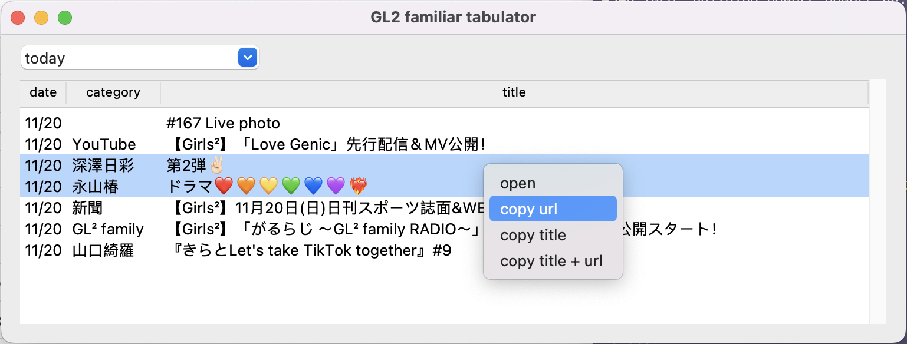
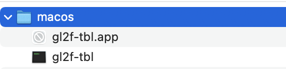

# GL2 Familiar Tabulator

GL2 family ファンクラブサイトの更新をGUIでチェックするアプリです。
とりあえず動くものができたので公開しています。
今後は最低限の機能を追加したあと、使いやすさを中心に開発を進めるつもりです。



**宣伝:heart:**
コマンドラインで動く [gl2f-cli](https://github.com/trnciii/gl2f-cli) もよろしくお願いします。


## インストール

[Release](https://github.com/trnciii/gl2f-tbl/releases) からOSにあわせてダウンロードしてください。

現時点でアプリケーションに署名をしていないためウイルスと判定がされます。
ここは作者を信用したうえで使ってもらえたらと思います。
**Windows** ではそのまま起動できました。
**MacOS** では以下の手順が必要でした。

### MacOS 用の操作

ダウンロードした zip を展開すると次のようになっています。



`gl2f-tbl.app` は削除してください。
アプリケーションの実体は `gl2f-tbl` (下のほう) です。
これを実行できるように権限を与えます。
ダウンロード・展開先がデフォルトの `Downloads` であればターミナルを開いて以下のようにします。
ファイルの場所が違う場合は最後の部分を置き換えてください。

```sh
chmod 755 Downloads/macos/gl2f-tbl
```

## 使い方

画面上部にページを選ぶメニューがあり、その下に取得したリストがあります。
リストの項目を選択し、右クリックからブラウザで開いたり、記事の情報をクリップボードにコピーすることができます。


取得するページはいまのところ次の選択肢があります。


